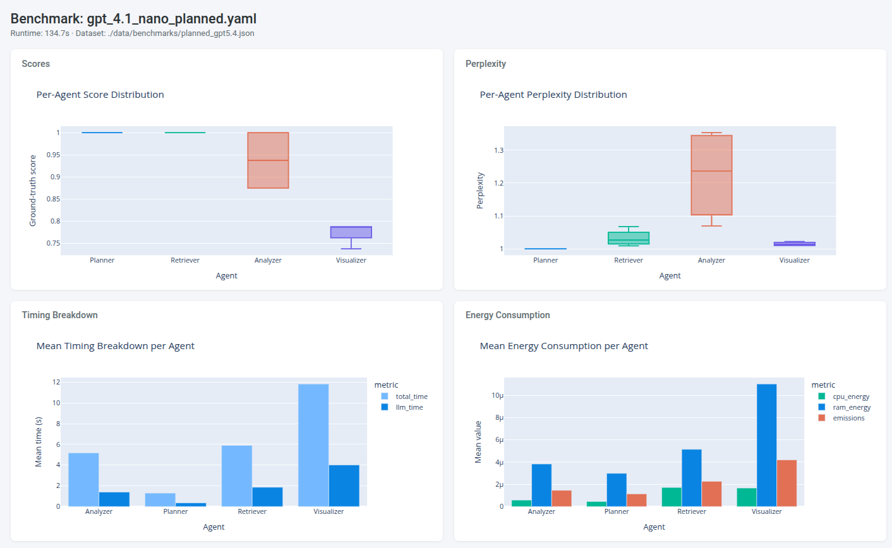

# ARCO framework

An agentic workflow profiling framework compatible with any
workflow built using our `Agent` and `Evaluator` abstraction.

Compatible with **OpenAI**, **OpenRouter** and **Ollama** backends.

It provides:

- Single agent **Best-of-N** support
- **Chain of Thought** integration
- Local **Energy and Emissions** profiling through CodeCarbon
- **Performance** profiling through a proper benchmarking interface

---

## System Requirements

Depending on the agents and models you use, you may also need:

- An available LLM backend:
  - OpenAI / OpenRouter API access (for OpenAI-based agents)
  - Ollama installed and running locally (for local models)
- A compatible environment for profiling:
  - CodeCarbon supports CPU/GPU/RAM energy tracking
  - GPU monitoring requires compatible hardware and drivers

---

## Installation

### 1. Clone the repository

```bash
git clone https://github.com/FilippoRiva/arco
cd arco
```

### 2. Install ARCO

> **Requirements:** This project uses [UV](https://docs.astral.sh/uv/) as its
> package manager. If you don't have it yet, install it with
> `curl -LsSf https://astral.sh/uv/install.sh | sh`
> or follow the [official installation guide](https://docs.astral.sh/uv/getting-started/installation/).

UV will automatically create a virtual environment and sync all dependencies:

```bash
uv sync
```

To use the sales workflows make sure to install the optional dependencies by :

```bash
uv sync --extra sales
```

### 3. Verify Installation

After installation, verify that the CLI is available:

```bash
uv run arco --help
```

You should see the available ARCO commands.

To invoke the command directly without repeating `uv run`, activate the
project's virtual environment first:

```bash
source .venv/bin/activate
arco --help
arco run
```

The activation only applies to the current shell. To install ARCO as a
standalone editable command available from any shell, use:

```bash
uv tool install --editable .
uv tool update-shell
```

Restart your shell afterwards, then run:

```bash
arco run
```

To load both the virtual environment and keyring credentials with one command
in the current shell, use:

```bash
source scripts/activate_arco.sh
arco run -c config/run_config/planned.yaml
```


Use the virtual-environment approach when developing ARCO, since changes are
immediately available after `uv sync`. Use `uv tool install --editable .` when
you want `arco` available globally while still reflecting source changes.

### Artifact storage defaults

Interactive `arco run` executions save workflow state and generated
visualization images by default under `./output/storage`. Benchmark commands
leave storage disabled by default to avoid producing an image for every test
case. Set `enable_storage: true` or `enable_storage: false` explicitly in a
configuration to override these mode-specific defaults.

### 4. Provider setup

#### Ollama Setup [Optional]

If you plan to use local models (which is needed for a proper profiling of your
agents), install Ollama and make sure the service is running:

```bash
systemctl status ollama
```

Then pull the desired model:

```bash
ollama pull <model-name>
```

#### OpenAI Setup [Optional]

For OpenAI-based agents, export the `OPENAI_API_KEY` environment variable
containing your API key:

```bash
export OPENAI_API_KEY=<your-api-key>
```

#### OpenRouter Setup [Optional]

For OpenRouter-based agents, export the `OPENROUTER_API_KEY` environment
variable containing your API key:

```bash
export OPENROUTER_API_KEY=<your-api-key>
```

#### API key management [Optional]

If you have the `secret-tool` command installed you can store your keys using : 

```bash
secret-tool store --label="<your-openai-key-label>" app arco provider openai
secret-tool store --label="<your-openrouter-key-label>" app arco provider openrouter
```

If you store them with these exacts names you can load by sourcing the `load_env_from_keyring.sh` script:

```bash
source load_env_from_keyring.sh
```

---

## Usage

The entire functionality of this framework is exposed through the `arco`
command-line tool.

ARCO provides four main sub-commands:

- `arco run` - execute a single agent workflow
- `arco benchmark` - evaluate multiple configurations against a benchmark dataset
- `arco generate-benchmark` - produce a benchmark dataset from a list of prompts
- `arco analyze-benchmark` - analyze benchmark outputs and produce HTML visuals

---

### `arco run`

Executes a single ARCO workflow

```bash
arco run
```

Options

```bash
--config -c  # Path to the ARCO configuration YAML file
--verbose -v # Display additional execution information, including agent
             # configuration and metrics
```

Example

```bash
arco run -c configs/example.yaml -v
```

Refer to [Run Configuration Files](docs/run_config.md) for writing run
configuration files.

### `arco generate-benchmark`

Produces a benchmark dataset (.json) by running a workflow configuration against
each prompt in a provided list.

```bash
arco generate-benchmark \
    --config <path-to-run-config.yaml> \
    --prompts <path-to-prompts.json> \
    --output <path-to-benchmark.json>
```

Options

```bash
--config  -c  # Path to the YAML run-configuration file used to generate the benchmark
--prompts -p  # Path to a JSON file containing a list of prompt strings
--output  -o  # Path where the generated benchmark dataset will be saved
--verbose -v  # Show detailed agent output during execution
```

Example

```bash
arco generate-benchmark \
    -c configs/example.yaml \
    -p datasets/prompts.json \
    -o datasets/sales_gt.json
```

As `arco run` does this scripts runs with run-configuration YAML files.
Refer to [Run Configuration Files](docs/run_config.md) for writing run
configuration files. Generally an extremely powerful model should be used
for benchmark generation.

The list of prompts json file should only contain a json list as : `['prompt_1','prompt_2',...,'prompt_n']`.

The generated JSON contains one entry per prompt, each with the agent's trace,
output, and metadata — ready to use as a ground-truth dataset for `arco benchmark`.

For catalog-managed experiments, the equivalent command is:

```bash
arco generate-benchmark --experiment sales-planned-gpt41-nano
```

### `arco benchmark`

Runs a benchmark suite by executing multiple ARCO configurations against a
ground-truth dataset.

```bash
arco benchmark \
    --dataset <path-to-dataset.json> \
    --config <path-to-benchmark.yaml>
```

Options

```bash
--dataset -d # Path to the benchmark ground-truth dataset (required)
--config -c  # Path to the benchmark configuration YAML file (required)
--save-dir   # Directory where benchmark results are stored (default: ./output/benchmarks)
--id         # Custom identifier for the benchmark run
--verbose -v # Enable detailed visualization of agent executions
```

Example

```bash
arco-cli benchmark \
    -d datasets/sales_gt.json \
    -c benchmarks/config.yaml \
    --save-dir output/results
```

Benchmark results are automatically saved as a series of CSV/json files
containing execution metrics, evaluations, and profiling information.

Refer to [Benchmark Configuration Files](docs/benchmark_config.md) for writing benchmark
configuration files. You can also run a catalog-managed experiment with:

```bash
arco benchmark --experiment sales-planned-gpt41-nano
```

See [Experiment Catalogs](docs/experiments.md) for the full generation,
benchmarking, and analysis workflow.

List catalog-managed experiments with:

```bash
arco experiments
```

### `arco analyze-benchmark`

Analyzes benchmark outputs and produces HTML visualizations.

```bash
arco analyze-benchmark <benchmark-output-dir>
```

Arguments

```bash
benchmark_dir  # Path to the benchmark output directory containing bench_metadata.json
```

Examples

```bash
arco analyze-benchmark output/benchmarks/my-experiment
arco analyze-benchmark --experiment sales-planned-gpt41-nano
```

This command reads the benchmark metadata and generates an HTML report with
interactive charts comparing execution metrics across configurations.

---

## Energy and emissions [CodeCarbon]

To fully exploit the benchmarking capability of ARCO, the
`enable_codecarbon: true` in the `run:` block of the YAML
configuration file should be set.

Energy usage and CO₂ emissions will be measured per-LLM-call and saved in
`run_metadata.json` alongside each run's artifacts.

---

## Output Examples



A sample benchmark analysis dashboard generated from a real benchmark run using
`arco analyze-benchmark`. Open the interactive HTML version at
[docs/benchmark_analysis/dashboard.html](docs/benchmark_analysis/dashboard.html)
to explore per-agent scores, timing breakdowns, energy consumption, and more.
