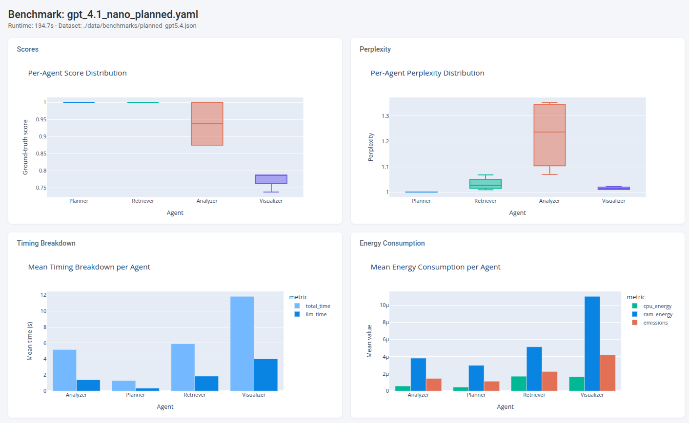

# ARCO framework

ARCO is an agentic workflow profiling framework for workflows built with its
`Agent` and `Evaluator` abstractions. It supports **OpenAI**, **OpenRouter**,
and **Ollama** backends, and provides:

- Best-of-N generation and iterative refinement
- Per-agent timing, energy, and emissions profiling through CodeCarbon
- Benchmark generation, execution, and analysis tools
- Interactive browsing of saved workflow states

## System requirements

Depending on the workflows and models you use, you may also need:

- Access to an LLM backend: OpenAI or OpenRouter credentials, or a running
  Ollama service
- Compatible hardware and drivers for GPU energy monitoring; CPU, RAM, and
  emissions tracking are supported by CodeCarbon

## Installation

### 1. Clone the repository

```bash
git clone https://github.com/FilippoRiva/arco
cd arco
```

### 2. Install ARCO

ARCO uses [UV](https://docs.astral.sh/uv/). Install it with
`curl -LsSf https://astral.sh/uv/install.sh | sh` or follow the
[UV installation guide](https://docs.astral.sh/uv/getting-started/installation/).
Then sync the project dependencies:

```bash
uv sync
```

To install the optional dependencies used by the sales workflows:

```bash
uv sync --extra sales
```

To install all the dependencies use: 

```bash
uv sync --all-extras
```

### 3. Verify the installation

```bash
uv run arco --help
```

During development, run commands through `uv run` or activate the project's
environment to avoid it:

```bash
source .venv/bin/activate
arco --help
```

### 4. Configure an LLM provider

For OpenAI, export an API key:

```bash
export OPENAI_API_KEY=<your-api-key>
```

For OpenRouter:

```bash
export OPENROUTER_API_KEY=<your-api-key>
```

For Ollama, install and start Ollama, then pull a model:

```bash
systemctl status ollama
ollama pull <model-name>
```

If `secret-tool` is installed, credentials can be stored in the keyring:

```bash
secret-tool store --label="OpenAI key" app arco provider openai
secret-tool store --label="OpenRouter key" app arco provider openrouter
```

Load credentials stored with those attributes using:

```bash
source scripts/load_env_from_keyring.sh
```

An alternative is sourcing the script that activates the project virtual-environment 
and loads the keyring credential in one go:

```bash
source scripts/activate_arco.sh
```

## Usage

The `arco` CLI provides six commands:

- `arco run` — execute one workflow
- `arco generate-benchmark` — generate a ground-truth dataset from prompts
- `arco benchmark` — execute benchmark runs against a dataset
- `arco analyze-benchmark` — analyze benchmark output and generate HTML pages
- `arco experiments` — list or inspect catalog experiments
- `arco storage` — browse saved workflow states

### `arco run`

Run a workflow interactively, or pass a run configuration:

```bash
arco run
arco run --config config/sales/run/planned.yaml
```

Options:

- `--config`, `-c`: run-configuration YAML; without it, ARCO prompts you to
  select a workflow
- `--verbose`, `-v`: show agent configuration and detailed execution metrics
- `--log {DEBUG,INFO,WARNING,ERROR}`: set ARCO's internal log level (default:
  `INFO`)

See [Run Configuration](docs/run_config.md) for configuration details.

### `arco generate-benchmark`

Run a workflow for each prompt and save the resulting ground-truth dataset:

```bash
arco generate-benchmark \
  --config config/sales/run/bench_gen_planned.yaml \
  --prompts config/sales/bench/prompts/prompts_demo.json \
  --output /tmp/sales-ground-truth.json
```

Options:

- `--config`, `-c`: run-configuration YAML
- `--prompts`, `-p`: JSON file containing a list of prompt strings or prompt
  objects
- `--output`, `-o`: destination for the generated dataset
- `--experiment`: use the generation config, prompts, and output path from a
  catalog experiment instead of passing the three paths
- `--verbose`, `-v`: show detailed agent output

A prompt file will be a dictionary containing an entry_id, a difficulty value and the prompt itself:
```json
[
  {"id": 10, "prompt": "Show sales for November 2021", "difficulty": 2},
]
```

Each successful prompt produces a dataset entry with its ID, prompt,
difficulty, and expected workflow trace. An evaluator may include structured
ground-truth data in each trace element. See [Run Configuration](docs/run_config.md)
for benchmark generation settings.

For a catalog-managed experiment:

```bash
arco generate-benchmark --experiment demo-planned-gpt41-nano
```

### `arco benchmark`

Execute each configured run against a ground-truth dataset:

```bash
arco benchmark \
  --dataset config/sales/bench/data/benchmark_demo.json \
  --config config/sales/bench/demo.yaml \
  --save-dir output/benchmarks
```

Options:

- `--dataset`, `-d`: ground-truth dataset JSON (required unless using
  `--experiment`)
- `--config`, `-c`: benchmark-configuration YAML (required unless using
  `--experiment`)
- `--experiment`: use the dataset, config, and output directory from a catalog
  experiment
- `--save-dir`: base output directory (default: `./output/benchmarks` for
  direct runs)
- `--id`: benchmark output directory name; by default the config filename stem
  is used for direct runs
- `--verbose`, `-v`: show detailed agent output
- `--log {DEBUG,INFO,WARNING,ERROR}`: set ARCO's internal log level (default:
  `INFO`)

For example, run the catalog experiment with:

```bash
arco benchmark --experiment demo-planned-gpt41-nano
```

Benchmark results are written under `<save-dir>/<id>/`. The directory contains
snapshots of the benchmark config and dataset, metadata, and a `runs/` folder
with one CSV per configured run. Each completed entry is checkpointed with its
full serialized state; rerunning with the same inputs resumes from matching
checkpoints and processes missing entries.

See [Benchmark Configuration](docs/benchmark_config.md) for config details.

### `arco analyze-benchmark`

Analyze an existing benchmark output directory containing
`bench_metadata.json`:

```bash
arco analyze-benchmark output/benchmarks/demo-planned-gpt41-nano
```

Or analyze a catalog experiment's configured output directory:

```bash
arco analyze-benchmark --experiment demo-planned-gpt41-nano
```

The command writes HTML output under `<benchmark-dir>/analysis/`:

- `dashboard.html` — interactive benchmark plots and comparisons
- `Output Visualizer.html` — choose a run and entry ID to compare the observed
  agent trace and state against the dataset's expected trace

### `arco experiments`

List experiments in the default `config/catalog.yaml` catalog:

```bash
arco experiments
```

Inspect an individual experiment's description, workflow, configs, dataset,
benchmark runs, and output status:

```bash
arco experiments demo-planned-gpt41-nano
```

Use `--catalog <path>` to list or inspect experiments in another catalog file.
See [Experiment Catalogs](docs/experiments.md) for the catalog format and
workflow.

### `arco storage`

Browse saved workflow states, newest first:

```bash
arco storage
```

The default storage directory is `./output/storage`. Use `--storage-dir <path>`
to select a different directory, or open a specific state directly:

```bash
arco storage --storage-dir output/storage --run-id <run-id>
```

In the interactive browser, use `↑`/`↓` to select a state, `Enter` to open it,
`d` to delete the selected state, `D` to delete all stored states, `←` or
`Backspace` to return to the list, and `q` to quit. Delete actions require
confirmation.

### Artifact storage defaults

Interactive `arco run` executions persist workflow states and generated
visualization images under `<save_dir>/storage` by default (`./output/storage`
when `save_dir` is not set). Benchmark and benchmark-generation commands leave
storage disabled by default to avoid saving artifacts for every prompt. Set
`global.enable_storage: true` or `false` in the relevant YAML to override the
default.

## Energy and emissions profiling (CodeCarbon)

CodeCarbon is controlled by the `enable_codecarbon` field in the configuration's
`global` section. It defaults to `false`; enable it with:

```yaml
global:
  enable_codecarbon: true
  save_dir: ./output
```

ARCO collects CPU, GPU, and RAM energy use and estimated CO₂ emissions for the
full agent step, including non-LLM work. LLM-call duration is tracked separately.
The metrics are attached to each agent's profiling data; verbose `arco run`
output and benchmark summaries expose them, and benchmark output can be explored
in the analysis dashboard. Benchmark configs use the same global setting, so
CodeCarbon profiling can be enabled for benchmark runs as well. The `save_dir`
setting controls ARCO's output/artifact location.

## Output example



A sample benchmark dashboard generated by `arco analyze-benchmark` is also
available as [interactive HTML](docs/benchmark_analysis/dashboard.html).
